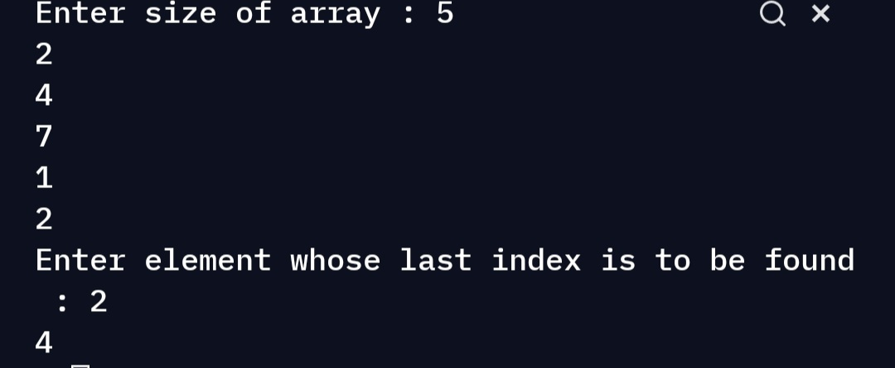

# Last index of an element in an array.

## Aim

The aim is to create a python code to get last index of an element in an array.

## Purpose

The purpose is to come up with an efficient solution while implementing recursion.

## Short description of project

The program takes 3 inputs. 1.size of array. 2.Array elements. 3.Elements whose last occurrence is to be found.

## Workflow of the Project

- We will divide the array into 2 parts. 1.The first element.

2. THE remaining elements.

- We will work on first element and recursion will work on rest.
- First we define the base case which will be if startindex of array is greater than length of array , return -1.
- Now we will call recursion on other part of array and see if the element is present there or not.
- If the element is present we return index+1.
- If not then we check the first element.
- If the first element is equal then we return 0 else return -1.

## Required libraries

None

## Compilation Steps

Run the script, after that :

1.  User is prompted to enter size of array followed by array elements and number whose occurrence is to be checked.
2.  Last index on which the element occurred is printed.

# Sample Input and output

## Sample Input 1

5 2 3 5 1 2 2

## Sample output 1

4

## Sample Input 1

6 1 7 1 2 3 2 5

## Sample Output 2

-1

# Output

## Author

[Siddhi Bhanushali](https://github.com/siddhi-244)
